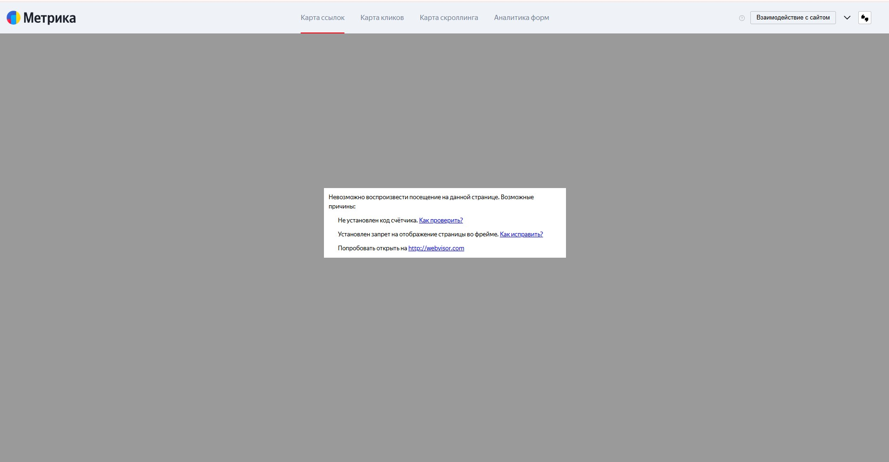

# Вебвизор и карты сайта в Яндекс.Метрике

Модуль решает проблему запрета показа сайта в iframe при включенноv функционале `Проактивная защита => Защита от фреймов`.

Также с помощью модуля вы можете указать свой список доверенных хостов (сайтов), а по умолчанию модуль разрешает показ вашего сайта для Яндекс.Метрики в разделах:
* Вебвизор
* Карта кликов
* Карта ссылок
* Карта скроллинга
* Аналитика форм

## Как обычно выглядит Яндекс.Метрика без модуля

## Как будет выглядеть Яндекс.Метрика с активным модулем

(на фотосессии)

