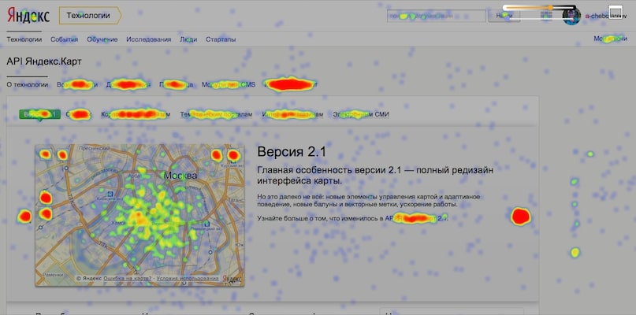

# Вебвизор и карты сайта в Яндекс.Метрике

Модуль решает проблему запрета показа сайта в iframe при включенноv функционале `Проактивная защита => Защита от фреймов`.

Также с помощью модуля вы можете указать свой список доверенных хостов (сайтов), а по умолчанию модуль разрешает показ вашего сайта для Яндекс.Метрики в разделах:
* Вебвизор
* Карта кликов
* Карта ссылок
* Карта скроллинга
* Аналитика форм

## Как обычно выглядит Яндекс.Метрика без модуля


## Как будет выглядеть Яндекс.Метрика с активным модулем



## Как установить?

* Из marketplace Bitrix
* [Из github](#install_via_github)
* [Через composer](#install_via_composer)

### Установить из github <a name="install_via_github"></a>

Действия:
1.* Развернуть код репозитория в папке `/path_to_site/bitrix/modules/dev2fun.frames`
1. Установить через админку битрикса. Обычно это url `https://your_domain.ru/bitrix/admin/partner_modules.php`
1. Активировать в настройках модуля. Обычно это url `https://your_domain.ru/bitrix/admin/settings.php?mid=dev2fun.frames`

### Установить через composer <a name="install_via_composer"></a>

Пример вашего composer.json с перед установкой модуля в `local/modules/`
```json
{
  "extra": {
    "installer-paths": {
      "local/modules/{$name}/": ["type:bitrix-module"]
    }
  }
}
```

Действия:
1. Убедиться в наличии настройки `extra` в `composer.json`
1. Выполнить `composer require dev2fun/dev2fun.frames`
1. Установить через админку битрикса. Обычно это url `https://your_domain.ru/bitrix/admin/partner_modules.php`
1. Активировать в настройках модуля. Обычно это url `https://your_domain.ru/bitrix/admin/settings.php?mid=dev2fun.frames`

